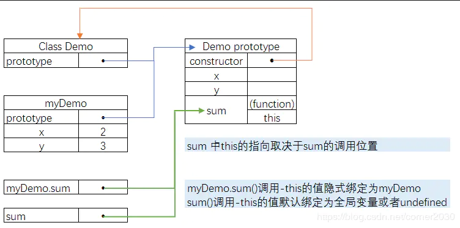
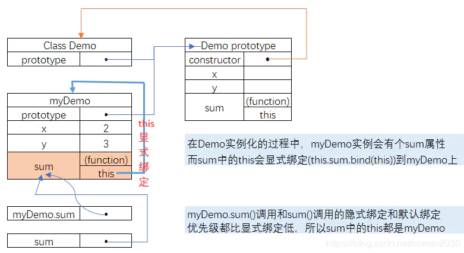

:question:深入理解ES6中class的this指向
==============
一、class的基本语法
-----
基本语法： **class name [extends]{ // class body }**  
在下面例子中，有两处的this：  
  - construcotr里的this.x = x 和 this.y = y   
在class的构造函数constructor内部中的环境，表示的是对象生效时的执行环境，而此时的this指向的就是该执行环境。
而对象生效的时候，是对象在实例化的过程（myDemo = new Demo(2, 3)）,所以这里的this是指向对象的实例myDemo。  
  - sum 函数里的 let sumVal = this.x + this.y   
  这里的this实际指向的是sum执行时的执行环境。
当以myDemo.sum()的方式运行时，其实是this的隐式绑定，当前tsum函数里的this实际上是指向myDemo实例。所以this能找到x和y，能够得到正确的结果。  
```js
"use strict";

class Demo {
    constructor(x, y) {
        this.x = x;
        this.y = y;
    }
    sum() {
        let sumVal = this.x + this.y;
        return sumVal;
    }
}

let myDemo = new Demo(2, 3);
console.log(myDemo.sum()); // 5
```
二、class中使用this的指向深入理解
----
对上述中的例子进行适当改造，将对象里面的方法sum作为对象赋值给新变量，然后调用新变量。   
此处主要改变了class中sum的调用位置：首先将myDemo.sum的引用赋值给新的变量sum，然后再调用该方法sum()。  
实际上，**class里的sum是一个对象内容，而myDemo.sum只是指向该sum的一个变量**。而将myDemo.sum赋值给新变量sum，只是让**新变量指向class的sum**，新变量sum与myDemo.sum本身没有关系。
```js
"use strict";

class Demo {
    constructor(x, y) {
    this.x = x;
    this.y = y;
    }
    sum() {
        let sumVal = this.x + this.y;
        return sumVal;
    }
}

let myDemo = new Demo(2, 3);
const sum = myDemo.sum; //将sum的引用赋值给新变量sum （写法等同于 const { sum } = myDemo;）
sum();// Uncaught TypeError: Cannot read property 'x' of undefined
```
sum函数里的this，会根据**是否是严格模式而指向undefined或者全局环境。**  
尽管在全局环境里执行sum()，因为是在严格模式下，所以这里的this指向的是undefined，而undefined没有属性x和y， 导致找不到该属性而抛出TypeError。   


    注：ES6 的class内部默认为严格模式

**解决this指向环境方法**

  - 在对象实例化时将sum中的this绑定到实例化对象中   
  当对象实例化时：let myDemo = new Demo(2, 3);，就将sum的this显式绑定到实例的this。   
而单独调用sum函数的时候，相当于是默认绑定。
**默认绑定优先级 < 显式绑定优先级**，所以就算单独运行sum函数，那么class的sum中this还是指向对应的实例化对象。
```js
class Demo {
    constructor(x, y) {
    this.x = x;
    this.y = y;
    this.sum = this.sum.bind(this); // sum中this显式绑定
    }
    sum() {
        let sumVal = this.x + this.y;
        return sumVal;
    }
}

let myDemo = new Demo(2, 3);
const sum = myDemo.sum; 
sum(); // 5
```

  - 使用箭头函数  
  ES6引入了箭头函数，箭头函数不仅简化了函数的缩写，另外一个很重要的特点是：**箭头函数不会创建自己的this值，它的this值是继承外层作用域链上的this**。

三、小结
---
**实际上，决定this的指向，是需要看它被调用的位置，而不是它被写入的位置。**    
同时，需要考虑到调用顺序：
```js
是否是new binding， const bar = new Foo()
是否是显示绑定，比如call，apply，bind， const bar = foo.call(obj2)
是否是隐式绑定，比如函数调用， const bar = obj1.foo()
最后是默认绑定，在严格模式下，this是undefined，否则是全局对象， 比如：const bar = foo()
```