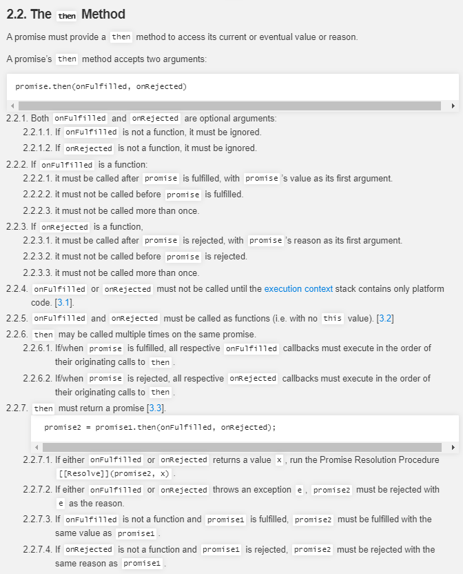
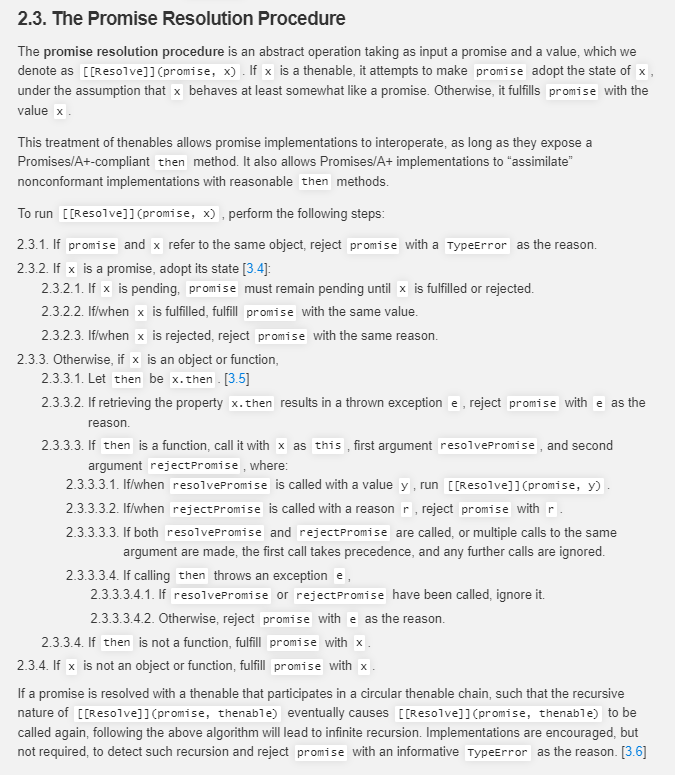

:collision: 实现 then 方法的链式调用
--------
**我们常常用到 `new Promise().then().then()`，这就是链式调用，用来解决回调地狱**

举个例子 :chestnut:   

``` js
let p1 = new Promise((resolve, reject) => {
    resolve(10)
})
p1.then(res => {
    console.log('fulfilled', res);
    return 2 * res
}).then(res => {
    console.log('fulfilled', res)
})
```
输出:point_down:
``` js
fulfilled 10
fulfilled 20
```

再举一个例子 :chestnut:   
``` js
const p2 = new Promise((resolve, reject) => {
    resolve(100)
})

p2.then(res => {
    console.log('fulfilled', res);
    return new Promise((resolve, reject) => resolve(3 * res))
}).then(res => {
    console.log('fulfilled', res)
})
```
输出:point_down:
``` js
fulfilled 100
fulfilled 300
```

我们先试一下当前我们手写的是否可以实现链式调用：

``` js
class myPromise {
    static PENDING = 'pending';
    static FULFILLED = 'fulfilled';
    static REJECTED = 'rejected';
    constructor(func) {
        this.PromiseState = myPromise.PENDING;
        this.PromiseResult = null;
        this.onFulfilledCallbacks = []; // 保存成功回调
        this.onRejectedCallbacks = []; // 保存失败回调
        try {
            func(this.resolve.bind(this), this.reject.bind(this));
        } catch (error) {
            this.reject(error)
        }
    }
    resolve(result) {
        if (this.PromiseState === myPromise.PENDING) {
            setTimeout(() => {
                this.PromiseState = myPromise.FULFILLED;
                this.PromiseResult = result;
                this.onFulfilledCallbacks.forEach(callback => {
                    callback(result)
                })
            });
        }
    }
    reject(reason) {
        if (this.PromiseState === myPromise.PENDING) {
            setTimeout(() => {
                this.PromiseState = myPromise.REJECTED;
                this.PromiseResult = reason;
                this.onRejectedCallbacks.forEach(callback => {
                    callback(reason)
                })
            });
        }
    }
    then(onFulfilled, onRejected) {
        onFulfilled = typeof onFulfilled === 'function' ? onFulfilled : value => value;
        onRejected = typeof onRejected === 'function' ? onRejected : reason => {
            throw reason;
        };
        if (this.PromiseState === myPromise.PENDING) {
            this.onFulfilledCallbacks.push(onFulfilled);
            this.onRejectedCallbacks.push(onRejected);
        }
        if (this.PromiseState === myPromise.FULFILLED) {
            setTimeout(() => {
                onFulfilled(this.PromiseResult);
            });
        }
        if (this.PromiseState === myPromise.REJECTED) {
            setTimeout(() => {
                onRejected(this.PromiseResult);
            });
        }
    }
}


// 测试代码
let p1 = new myPromise((resolve, reject) => {
    resolve(10)
})
p1.then(res => {
    console.log('fulfilled', res);
    return 2 * res
}).then(res => {
    console.log('fulfilled', res)
})
```

毫无疑问在控制台里面是会报错的，提示 `then` 方法没有定义：

`Uncaught TypeError: Cannot read property 'then' of undefined`

`Promise.prototype.then()` **方法返回一个新的Promise实例（注意，不是原来那个`Promise`实例）。因此可以采用链式写法，即then方法后面再调用另一个then方法。**

### 1. Promise/A+ 规范的理解
----------------

**想要实现`then`方法的链式调用，就必须彻底搞懂`then`方法，这里我们参考 [Promises/A+](https://promisesaplus.com/) 规范:point_down:**



规范在`2.2.7`中这样描述 :point_down:：

◾ **2.2.7 then 方法必须返回一个 promise 对象**
``` js
promise2 = promise1.then(onFulfilled, onRejected);
```
  - **2.2.7.1** 如果 `onFulfilled` 或者 `onRejected` 返回一个值 `x` ，则运行下面的 **Promise 解决过程：**`[[Resolve]](promise2, x)`
  - **2.2.7.2** 如果 `onFulfilled` 或者 `onRejected` 抛出一个异常 `e` ，则 `promise2` 必须拒绝执行，并返回拒因 `e`
  - **2.2.7.3** 如果 `onFulfilled` 不是函数且 `promise1` 成功执行， `promise2` 必须成功执行并返回相同的值
  - **2.2.7.4** 如果 `onRejected` 不是函数且 `promise1` 拒绝执行， `promise2` 必须拒绝执行并返回相同的据因

理解上面的`“返回”`部分非常重要，即：**不论 promise1 被 reject 还是被 resolve 时 promise2 都会执行 Promise 解决过程：`[[Resolve]](promise2, x)`，只有出现异常时才会被 rejected。**

注意 **2.2.7.1** ：

    If either onFulfilled or onRejected returns a value x, run the Promise Resolution Procedure [[Resolve]]
    (promise2, x).

即：如果 `onFulfilled` 或者 `onRejected` 返回一个值 `x` ，则运行下面的 **Promise 解决过程：**`[[Resolve]](promise2, x)`

规范在 **2.3** 中详细描述 **Promise 解决过程** `The Promise Resolution Procedure` :point_down:



译过来 :point_down:：

**2.3 Promise 解决过程**

**Promise 解决过程** 是一个抽象的操作，其需输入一个 `promise` 和一个值，我们表示为 `[[Resolve]](promise, x)`，如果 `x` 有 `then` 方法且看上去像一个 `Promise` ，解决程序即尝试使 `promise` 接受 `x` 的状态；否则其用 `x` 的值来执行 `promise` 。

这种 `thenable` 的特性使得 `Promise` 的实现更具有通用性：**只要其暴露出一个遵循 `Promises/A+` 协议的 `then` 方法即可；这同时也使遵循 `Promises/A+` 规范的实现可以与那些不太规范但可用的实现能良好共存。**

**运行 `[[Resolve]](promise, x)` 需遵循以下步骤：**

▪ **2.3.1 `x` 与 promise 相等**

如果 `promise` 和 `x` 指向同一对象，以 `TypeError` 为据因拒绝执行 `promise`

▪ **2.3.2 `x` 为 Promise**

如果 `x` 为 Promise ，则使 `promise` 接受 `x` 的状态

  - 2.3.2.1 如果 `x` 处于等待态， `promise` 需保持为等待态直至 `x` 被执行或拒绝
  - 2.3.2.2 如果 `x` 处于执行态，用相同的值执行 `promise`
  - 2.3.2.3 如果 `x` 处于拒绝态，用相同的据因拒绝 `promise`

▪ **2.3.3 `x` 为对象或函数**

如果 x 为对象或者函数：

  - 2.3.3.1 把 `x.then` 赋值给 `then`

  - 2.3.3.2 如果取 `x.then` 的值时抛出错误 `e` ，则以 `e` 为据因拒绝 `promise`

  - 2.3.3.3 如果 `then` 是函数，将 `x` 作为函数的作用域 `this` 调用之。传递两个回调函数作为参数，第一个参数叫做 `resolvePromise` ，第二个参数叫做 `rejectPromise`:

    - 2.3.3.3.1 如果 `resolvePromise` 以值 `y` 为参数被调用，则运行 `[[Resolve]](promise, y)`

    - 2.3.3.3.2 如果 `rejectPromise` 以据因 `r` 为参数被调用，则以据因 `r` 拒绝 `promise`

    - 2.3.3.3.3 如果 `resolvePromise` 和 `rejectPromise` 均被调用，或者被同一参数调用了多次，则优先采用首次调用并忽略剩下的调用

    - 2.3.3.3.4 如果调用 `then` 方法抛出了异常 `e`：

      - 2.3.3.3.4.1 如果 `resolvePromise` 或 `rejectPromise` 已经被调用，则忽略之
      - 2.3.3.3.4.2 否则以 `e` 为据因拒绝 `promise`

    - 2.3.3.4 如果 `then` 不是函数，以 `x` 为参数执行 `promise`

▪ 2.3.4 **如果 `x` 不为对象或者函数，以 `x` 为参数执行 `promise`**

如果一个 `promise` 被一个循环的 `thenable` 链中的对象解决，而 `[[Resolve]](promise, thenable)` 的递归性质又使得其被再次调用，根据上述的算法将会陷入无限递归之中。算法虽不强制要求，但也鼓励施者检测这样的递归是否存在，若检测到存在则以一个可识别的 `TypeError` 为据因来拒绝 `promise`。

### 2.Promise/A+ 规范的总结
--------------
基于规范的描述，我们得到以下几点：

◾ 1. `then`方法本身会返回一个新的`Promise`对象，返回一个新的Promise以后它就有自己的`then`方法，这样就能实现无限的链式

◾ 2. 不论 `promise1` 被 `resolve()`  还是被 `reject()` 时 `promise2` 都会执行 `Promise 解决过程：[[Resolve]](promise2, x)`

在手写这里我们把这个 `Promise 解决过程：[[Resolve]](promise2, x)` 命名为 `resolvePromise()` 方法，参数为 `(promise2, x, resolve, reject)` 即：
``` js
function resolvePromise(promise2, x, resolve, reject) {}
```
`resolvePromise()`各参数的意义：
``` js
/**
 * 对resolve()、reject() 进行改造增强 针对resolve()和reject()中不同值情况 进行处理
 * @param  {promise} promise2 promise1.then方法返回的新的promise对象
 * @param  {[type]} x         promise1中onFulfilled或onRejected的返回值
 * @param  {[type]} resolve   promise2的resolve方法
 * @param  {[type]} reject    promise2的reject方法
 */
function resolvePromise(promise2, x, resolve, reject) {}
```
其实，这个`resolvePromise(promise2, x, resolve, reject)` 即 `Promise 解决过程：[[Resolve]](promise2, x)` 就是对`resolve()、reject()` 进行**改造增强**， 针对`resolve()`和`reject()`中不同值情况 进行处理。

`resolve()`和`reject()` 返回的 `x` 值的几种情况：

1. 普通值
2. Promise对象
3. thenable对象/函数

**下面我们就根据总结的两点，结合 `Promises/A+ 规范` 来实现 `then` 方法的链式调用**:muscle::muscle::muscle:

### 3.then 方法返回一个新的 Promise
-------------------------------
◾ **2.2.7规范 then 方法必须返回一个 promise 对象**

我们在`then`方法里面返回一个 `新的手写Promise实例`，再把原来的代码复制上去：
``` js
class myPromise {
	...
    then(onFulfilled, onRejected) {
        onFulfilled = typeof onFulfilled === 'function' ? onFulfilled : value => value;
        onRejected = typeof onRejected === 'function' ? onRejected : reason => {
            throw reason;
        };
        
+       const promise2 = new myPromise((resolve, reject) => {
            if (this.PromiseState === myPromise.FULFILLED) {
                setTimeout(() => {
                    onFulfilled(this.PromiseResult);
                });
            } else if (this.PromiseState === myPromise.REJECTED) {
                setTimeout(() => {
                    onRejected(this.PromiseResult);
                });
            } else if (this.PromiseState === myPromise.PENDING) {
                this.onFulfilledCallbacks.push(onFulfilled);
                this.onRejectedCallbacks.push(onRejected);
            }
+       })
        
+       return promise2
    }
}
```
◾ **2.2.7.1规范** 如果 `onFulfilled` 或者 `onRejected` 返回一个值 `x` ，则运行下面的 **Promise 解决过程：`[[Resolve]](promise2, x)`**
``` js
class myPromise {
	...
    then(onFulfilled, onRejected) {
        onFulfilled = typeof onFulfilled === 'function' ? onFulfilled : value => value;
        onRejected = typeof onRejected === 'function' ? onRejected : +reason => {
            throw reason;
        };

        const promise2 = new myPromise((resolve, reject) => {
            if (this.PromiseState === myPromise.FULFILLED) {
                setTimeout(() => {
+                   let x = onFulfilled(this.PromiseResult);
+                   resolvePromise(promise2, x, resolve, reject);
                });
            } else if (this.PromiseState === myPromise.REJECTED) {
                setTimeout(() => {
+                   let x = onRejected(this.PromiseResult);
+                   resolvePromise(promise2, x, resolve, reject);
                });
            } else if (this.PromiseState === myPromise.PENDING) {
                this.onFulfilledCallbacks.push(onFulfilled);
                this.onRejectedCallbacks.push(onRejected);
            }
        })

        return promise2
    }
}

+/**
+ * 对resolve()、reject() 进行改造增强 针对resolve()和reject()中不同值情况 进行处理
+ * @param  {promise} promise2 promise1.then方法返回的新的promise对象
+ * @param  {[type]} x         promise1中onFulfilled或onRejected的返回值
+ * @param  {[type]} resolve   promise2的resolve方法
+ * @param  {[type]} reject    promise2的reject方法
+ */
+ function resolvePromise(promise2, x, resolve, reject) {}
```
我们在 `myPromise` 类外面声明了一个 **Promise 解决过程**：
``` js
function resolvePromise(promise2, x, resolve, reject) {

}
```
`resolvePromise()` **具体方法我们后面会补充~**

◾ **2.2.7.2 如果 `onFulfilled` 或者 `onRejected` 抛出一个异常 `e` ，则 `promise2` 必须拒绝执行，并返回拒因 `e`**
``` js
class myPromise {
	...
    then(onFulfilled, onRejected) {
        onFulfilled = typeof onFulfilled === 'function' ? onFulfilled : value => value;
        onRejected = typeof onRejected === 'function' ? onRejected : reason => {
            throw reason;
        };

        const promise2 = new myPromise((resolve, reject) => {
            if (this.PromiseState === myPromise.FULFILLED) {
                setTimeout(() => {
+                   try {
                        let x = onFulfilled(this.PromiseResult);
                        resolvePromise(promise2, x, resolve, reject);
+                   } catch (e) {
+                       reject(e); // 捕获前面onFulfilled中抛出的异常
+                   }
                });
            } else if (this.PromiseState === myPromise.REJECTED) {
                setTimeout(() => {
+                   try {
                        let x = onRejected(this.PromiseResult);
                        resolvePromise(promise2, x, resolve, reject);
+                   } catch (e) {
+                       reject(e)
+                   }
                });
            } else if (this.PromiseState === myPromise.PENDING) {
                this.onFulfilledCallbacks.push(onFulfilled);
                this.onRejectedCallbacks.push(onRejected);
            }
        })

        return promise2
    }
}

/**
 * 对resolve()、reject() 进行改造增强 针对resolve()和reject()中不同值情况 进行处理
 * @param  {promise} promise2 promise1.then方法返回的新的promise对象
 * @param  {[type]} x         promise1中onFulfilled或onRejected的返回值
 * @param  {[type]} resolve   promise2的resolve方法
 * @param  {[type]} reject    promise2的reject方法
 */
function resolvePromise(promise2, x, resolve, reject) {}
```
◾ **`fulfilled` 和 `rejected` 状态处理完，不要忘了 `pending` 状态的情况**

我们在 `pending` 状态保存的 `resolve()` 和 `reject()` 回调也要符合 `2.2.7.1 和 2.2.7.2 规范`：

    如果 onFulfilled 或者 onRejected 返回一个值 x ，则运行 Promise 解决过程：[[Resolve]](promise2, x)
    如果 onFulfilled 或者 onRejected 抛出一个异常 e ，则 promise2 必须拒绝执行，并返回拒因 e
``` js
class myPromise {
	...
    then(onFulfilled, onRejected) {
        onFulfilled = typeof onFulfilled === 'function' ? onFulfilled : value => value;
        onRejected = typeof onRejected === 'function' ? onRejected : reason => {
            throw reason;
        };

        const promise2 = new myPromise((resolve, reject) => {
            if (this.PromiseState === myPromise.FULFILLED) {
                setTimeout(() => {
                    try {
                        let x = onFulfilled(this.PromiseResult);
                        resolvePromise(promise2, x, resolve, reject);
                    } catch (e) {
                        reject(e); // 捕获前面onFulfilled中抛出的异常
                    }
                });
            } else if (this.PromiseState === myPromise.REJECTED) {
                setTimeout(() => {
                    try {
                        let x = onRejected(this.PromiseResult);
                        resolvePromise(promise2, x, resolve, reject);
                    } catch (e) {
                        reject(e)
                    }
                });
            } else if (this.PromiseState === myPromise.PENDING) {
+              this.onFulfilledCallbacks.push(() => {
+                   try {
+                        let x = onFulfilled(this.PromiseResult);
+                       resolvePromise(promise2, x, resolve, reject)
+                   } catch (e) {
+                       reject(e);
+                   }
+               });
+               this.onRejectedCallbacks.push(() => {
+                   try {
+                       let x = onRejected(this.PromiseResult);
+                       resolvePromise(promise2, x, resolve, reject);
+                   } catch (e) {
+                       reject(e);
+                   }
+               });
            }
        })

        return promise2
    }
}
```
搞定 `then` 方法:sunglasses:

下面我们开始着手写 **promise 解决过程 `resolvePromise(promise2, x, resolve, reject)`**