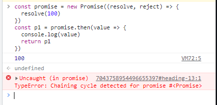
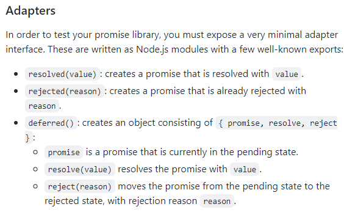
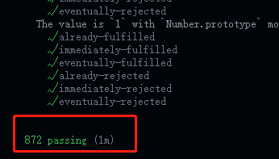

:sunny: 实现 resolvePromise 方法
---------
◾ **2.3.1 如果 `promise` 和 `x` 指向同一对象，以 `TypeError` 为据因拒绝执行 `promise`**
``` js
/**
 * 对resolve()、reject() 进行改造增强 针对resolve()和reject()中不同值情况 进行处理
 * @param  {promise} promise2 promise1.then方法返回的新的promise对象
 * @param  {[type]} x         promise1中onFulfilled或onRejected的返回值
 * @param  {[type]} resolve   promise2的resolve方法
 * @param  {[type]} reject    promise2的reject方法
 */
function resolvePromise(promise2, x, resolve, reject) {
	// 如果从onFulfilled或onRejected中返回的 x 就是promise2，会导致循环引用报错
+   if (x === promise2) {
+       return reject(new TypeError('Chaining cycle detected for promise'));
+   }
}
```
例如下面这种情况:point_down:
``` js
const promise = new Promise((resolve, reject) => {
  resolve(100)
})
const p1 = promise.then(value => {
  console.log(value)
  return p1
})
```
使用原生 Promise 执行这个代码，会报类型错误：



◾ **2.3.2 如果 `x` 为 Promise ，则使 `promise` 接受 `x` 的状态**
``` js
class myPromise {
	...
}

/**
 * 对resolve()、reject() 进行改造增强 针对resolve()和reject()中不同值情况 进行处理
 * @param  {promise} promise2 promise1.then方法返回的新的promise对象
 * @param  {[type]} x         promise1中onFulfilled或onRejected的返回值
 * @param  {[type]} resolve   promise2的resolve方法
 * @param  {[type]} reject    promise2的reject方法
 */
function resolvePromise(promise2, x, resolve, reject) {
    if (x === promise2) {
        return reject(new TypeError('Chaining cycle detected for promise'));
    }

    // 2.3.2 如果 x 为 Promise ，则使 promise2 接受 x 的状态
+   if (x instanceof myPromise) {
+       if (x.PromiseState === myPromise.PENDING) {
+           /**
+            * 2.3.2.1 如果 x 处于等待态， promise 需保持为等待态直至 x 被执行或拒绝
+            *         注意"直至 x 被执行或拒绝"这句话，
+            *         这句话的意思是：x 被执行x，如果执行的时候拿到一个y，还要继续解析y
+            */
+           x.then(y => {
+               resolvePromise(promise2, y, resolve, reject)
+           }, reject);
+       } else if (x.PromiseState === myPromise.FULFILLED) {
+           // 2.3.2.2 如果 x 处于执行态，用相同的值执行 promise
+           resolve(x.PromiseResult);
+       } else if (x.PromiseState === myPromise.REJECTED) {
+           // 2.3.2.3 如果 x 处于拒绝态，用相同的据因拒绝 promise
+           reject(x.PromiseResult);
+       }
+   }
}
```
马上就要成功啦，还有最后一条:sunglasses:

◾ **2.3.3 如果 `x` 为对象或者函数**

◾ **2.3.4 如果 `x` 不为对象或者函数，以 `x` 为参数执行 `promise`**

在判断`x`是对象或函数时，`x` 不能是 `null`，因为 `typeof null`的值也为 `object`

我们应该显式的声明 `x != null`，这样 当 `x` 为 `null` 时，直接执行`resolve(x)`，否则，如果不这样不声明，`x` 为 `null` 时就会走到`catch`然后`reject`，这不是我们要的，所以需要检测下`null`：
``` js
if (x != null && ((typeof x === 'object' || (typeof x === 'function'))))
```

◾ **2.3.3 和 2.3.4 规范实现如下：**
``` js
class myPromise {
	...
}

/**
 * 对resolve()、reject() 进行改造增强 针对resolve()和reject()中不同值情况 进行处理
 * @param  {promise} promise2 promise1.then方法返回的新的promise对象
 * @param  {[type]} x         promise1中onFulfilled或onRejected的返回值
 * @param  {[type]} resolve   promise2的resolve方法
 * @param  {[type]} reject    promise2的reject方法
 */
function resolvePromise(promise2, x, resolve, reject) {
    if (x === promise2) {
        return reject(new TypeError('Chaining cycle detected for promise'));
    }

    // 2.3.2 如果 x 为 Promise ，则使 promise2 接受 x 的状态
    if (x instanceof myPromise) {
        if (x.PromiseState === myPromise.PENDING) {
            /**
             * 2.3.2.1 如果 x 处于等待态， promise 需保持为等待态直至 x 被执行或拒绝
             *         注意"直至 x 被执行或拒绝"这句话，
             *         这句话的意思是：x 被执行x，如果执行的时候拿到一个y，还要继续解析y
             */
            x.then(y => {
                resolvePromise(promise2, y, resolve, reject)
            }, reject);
        } else if (x.PromiseState === myPromise.FULFILLED) {
            // 2.3.2.2 如果 x 处于执行态，用相同的值执行 promise
            resolve(x.PromiseResult);
        } else if (x.PromiseState === myPromise.REJECTED) {
            // 2.3.2.3 如果 x 处于拒绝态，用相同的据因拒绝 promise
            reject(x.PromiseResult);
        }
+   } else if (x !== null && ((typeof x === 'object' || (typeof x === 'function')))) {
+       // 2.3.3 如果 x 为对象或函数
+       try {
+           // 2.3.3.1 把 x.then 赋值给 then
+           var then = x.then;
+       } catch (e) {
+           // 2.3.3.2 如果取 x.then 的值时抛出错误 e ，则以 e 为据因拒绝 promise
+           return reject(e);
+       }
+
+       /**
+        * 2.3.3.3 
+        * 如果 then 是函数，将 x 作为函数的作用域 this 调用之。
+        * 传递两个回调函数作为参数，
+        * 第一个参数叫做 `resolvePromise` ，第二个参数叫做 `rejectPromise`
+        */
+       if (typeof then === 'function') {
+           // 2.3.3.3.3 如果 resolvePromise 和 rejectPromise 均被调用，或者被同一参数调用了多次，则优先采用首次调用并忽略剩下的调用
+           let called = false; // 避免多次调用
+           try {
+               then.call(
+                   x,
+                   // 2.3.3.3.1 如果 resolvePromise 以值 y 为参数被调用，则运行 [[Resolve]](promise, y)
+                   y => {
+                       if (called) return;
+                       called = true;
+                       resolvePromise(promise2, y, resolve, reject);
+                   },
+                   // 2.3.3.3.2 如果 rejectPromise 以据因 r 为参数被调用，则以据因 r 拒绝 promise
+                   r => {
+                       if (called) return;
+                       called = true;
+                       reject(r);
+                   }
+               )
+           } catch (e) {
+               /**
+                * 2.3.3.3.4 如果调用 then 方法抛出了异常 e
+                * 2.3.3.3.4.1 如果 resolvePromise 或 rejectPromise 已经被调用，则忽略之
+                */
+               if (called) return;
+               called = true;
+
+               /**
+                * 2.3.3.3.4.2 否则以 e 为据因拒绝 promise
+                */
+               reject(e);
+           }
+       } else {
+           // 2.3.3.4 如果 then 不是函数，以 x 为参数执行 promise
+           resolve(x);
+       }
+   } else {
+       // 2.3.4 如果 x 不为对象或者函数，以 x 为参数执行 promise
+       return resolve(x);
+   }
}
```

打完收工:sparkles::sparkles::sparkles::sparkles:

### Promise A+ 测试
---------------------
如何证明我们写的`myPromise`就符合 **Promises/A+** 规范呢？

跑一下 Promise A+ 测试 就好啦~

**1. 安装官方测试工具**

我们使用Promises/A+官方的测试工具 [promises-aplus-tests](https://github.com/promises-aplus/promises-tests) 来对我们的`myPromise`进行测试

**安装** `promises-aplus-tests`:
``` js
npm install promises-aplus-tests -D
```
**2. 使用 CommonJS 对外暴露 myPromise 类**
``` js
class myPromise {
	...
}

function resolvePromise(promise2, x, resolve, reject) { 
	...
}

+ module.exports = myPromise;
```
**3. 实现静态方法 deferred**
要使用 `promises-aplus-tests` 这个工具测试，必须实现一个静态方法`deferred()`，官方对这个方法的定义如下:



意思就是：
我们要给自己手写的`myPromise`上实现一个静态方法`deferred()`，该方法要返回一个包含`{ promise, resolve, reject }`的对象：

  - `promise` 是一个处于`pending`状态的 Promsie。
  - `resolve(value)` 用`value`解决上面那个`promise`
  - `reject(reason)` 用`reason`拒绝上面那个`promise`

**`deferred()`的实现如下：**
``` js
class myPromise {
	...
}

function resolvePromise(promise2, x, resolve, reject) { 
	...
}

+  myPromise.deferred = function () {
+      let result = {};
+      result.promise = new myPromise((resolve, reject) => {
+          result.resolve = resolve;
+          result.reject = reject;
+      });
+      return result;
+  }

module.exports = myPromise;
```

**4. 配置 package.json**

新建一个 `package.json` ，配置如下：
``` js
// package.json
{
  "devDependencies": {
    "promises-aplus-tests": "^2.1.2"
  },
  "scripts": {
    "test": "promises-aplus-tests myPromise(js文件名)"
  }
}
```

准备工作已就绪，接下来就可以执行 `npm run test` 测试命令来见证奇迹啦~~~:star2::star2::star2:

